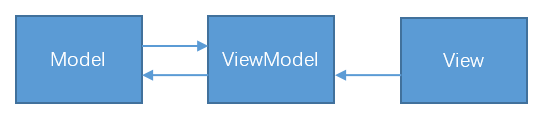
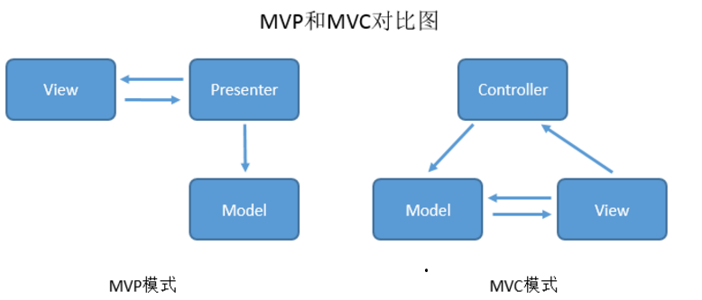
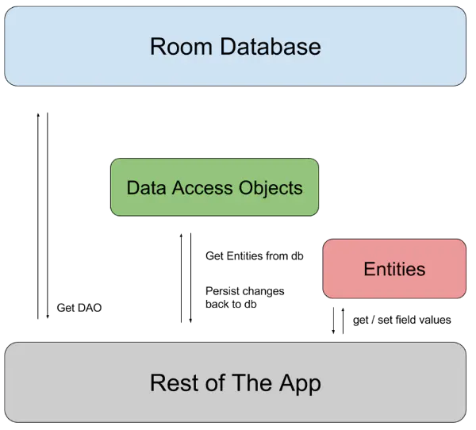
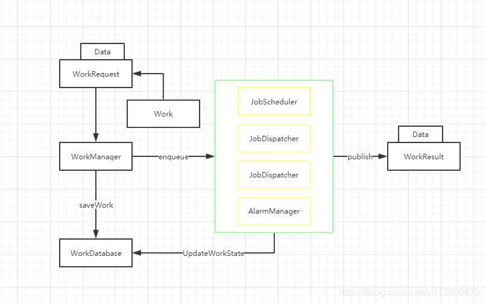
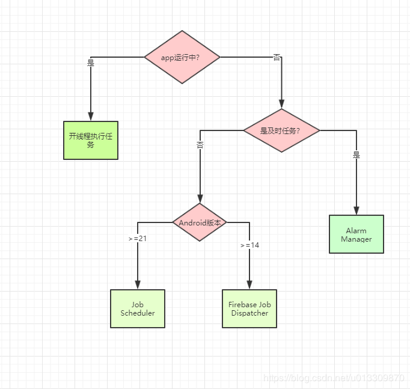

[TOC]


## 安卓基础知识

安卓四大组件：Activity、Service、BroadCast Receiver、Content provider

### Activity

Activity是app与用户交互的入口，表示应用中的一个屏幕

###### mainfest清单文件

###### Activity的声明

```xml
<manifest ... >
      <application ... >
          <activity 
                android:name=".ExampleActivity" 
                android:label="ExampleActivity"/>
          ...
      </application ... >
      ...
    </manifest >
```

通过Intent filter可以设置Activity的的功能

```xml
<activity android:name=".ExampleActivity" android:icon="@drawable/app_icon">
    <intent-filter>
        <action android:name="android.intent.action.SEND" />
        <category android:name="android.intent.category.DEFAULT" />
        <data android:mimeType="text/plain" />
    </intent-filter>
</activity>
```

在此示例中，<action> 元素指定该 Activity 会发送数据。将 <category> 元素声明为 DEFAULT 可使 Activity 能够接收启动请求。<data> 元素指定此 Activity 可以发送的数据类型。

如何调用

```java
// Create the text message with a string
Intent sendIntent = new Intent();
sendIntent.setAction(Intent.ACTION_SEND);
sendIntent.setType("text/plain");
sendIntent.putExtra(Intent.EXTRA_TEXT, textMessage);
// Start the activity
startActivity(sendIntent);
```

声明应用权限

```xml
<manifest>
<activity android:name="...."
	android:permission=”com.google.socialapp.permission.SHARE_POST”
/>
```

声明用户权限

```xml
<manifest>
   <uses-permission android:name="com.google.socialapp.permission.SHARE_POST" />
</manifest>
```
###### 生命周期

下图为Activity 生命周期的简化图示


- onCreate()`在系统首次创建 Activity触发 。在 Activity 的整个生命周期中只应发生一次。初始化 Activity 的基本组件,例如创建试图并将数据绑定到列表中。在此调用`setContentView()`定义 Activity 界面的布局。此方法会接收 `savedInstanceState` 参数（包含 Activity 先前保存状态的 `Bundle` 对象）。如果 Activity 此前未曾存在，`Bundle` 对象的值为 null。

- `onStart()`Activity 用来做进入前台与用户进行互动之前的最后准备工作。

- `onResume`捕获所有用户输入，应用的大部分核心功能都是在 `onResume()` 方法中实现的，后面总是跟着 `onPause()` 回调。
- `onPause()`表示用户暂时离开了该Activity，为用户离开activity的第一个标志。*可以使用 [`onPause()`](https://developer.android.com/reference/android/app/Activity?hl=zh-cn#onPause()) 方法释放系统资源、传感器（例如 GPS）手柄，或当您的 Activity 暂停且用户不需要它们时仍然可能影响电池续航时间的任何资源。*
- `onStop()` Activity 被销毁，新的 Activity 启动，或者现有的 Activity 正在进入“已恢复”状态并覆盖了已停止的 Activity。停止的 Activity 都将完全不再可见。
- `onRestart()` Activity 停止时的状态恢复 Activity。
- `onDestroy()`销毁 Activity 之前调用此回调。由于配置变更（例如设备旋转或多窗口模式），系统暂时销毁 Activity

oncreate方法实例

```java
TextView textView;

// some transient state for the activity instance
String gameState;

@Override
public void onCreate(Bundle savedInstanceState) {
    // call the super class onCreate to complete the creation of activity like
    // the view hierarchy
    super.onCreate(savedInstanceState);//重要语句，调用父类的

    // recovering the instance state
    if (savedInstanceState != null) {
        gameState = savedInstanceState.getString(GAME_STATE_KEY);
    }

    // set the user interface layout for this activity
    // the layout file is defined in the project res/layout/main_activity.xml file
    setContentView(R.layout.main_activity);//重要绑定视图

    // initialize member TextView so we can manipulate it later
    textView = (TextView) findViewById(R.id.text_view);//找到mainactivity中id为text_view的组件
}

// This callback is called only when there is a saved instance that is previously saved by using
// onSaveInstanceState(). We restore some state in onCreate(), while we can optionally restore
// other state here, possibly usable after onStart() has completed.
// The savedInstanceState Bundle is same as the one used in onCreate().
@Override
public void onRestoreInstanceState(Bundle savedInstanceState) {
    textView.setText(savedInstanceState.getString(TEXT_VIEW_KEY));
}

// invoked when the activity may be temporarily destroyed, save the instance state here
@Override
public void onSaveInstanceState(Bundle outState) {
    outState.putString(GAME_STATE_KEY, gameState);
    outState.putString(TEXT_VIEW_KEY, textView.getText());

    // call superclass to save any view hierarchy
    super.onSaveInstanceState(outState);
}
```
生命周期感知型组件`onResume`事件处理
```java
public class CameraComponent implements LifecycleObserver {

    ...

    @OnLifecycleEvent(Lifecycle.Event.ON_RESUME)
    public void initializeCamera() {
        if (camera == null) {
            getCamera();
        }
    }

    ...
}
```

生命周期感知型组件`onPause`事件处理

```java
public class JavaCameraComponent implements LifecycleObserver {

    ...

    @OnLifecycleEvent(Lifecycle.Event.ON_PAUSE)
    public void releaseCamera() {
        if (camera != null) {
            camera.release();
            camera = null;
        }
    }

    ...
}
```

`onStop()`方法实例

```java
@Override
protected void onStop() {
    // call the superclass method first
    super.onStop();//重要
    //也可以做一些其他的事情

    );
}
```
进程生命周期和 Activity 状态之间的关系
| 系统终止进程的可能性 | 进程状态                   | Activity 状态        |
| :------------------- | :------------------------- | :------------------- |
| 较小                 | 前台（拥有或即将获得焦点） | 已创建 已开始 已恢复 |
| 较大                 | 后台（失去焦点）           | 已暂停               |
| 最大                 | 后台（不可见）             | 已停止               |
| 空                   | 已销毁                     |                      |

###### 从一个Activity启动另外一个Activity

可以使用 `startActivity()` 或 `startActivityForResult()` 方法启动新 Activity。这两种方法都需要传入一个 `Intent` 对象。

```java
//如何启动一个名为 SignInActivity 的 Activity
Intent intent = new Intent(this, SignInActivity.class);
startActivity(intent);
/*EXTRA_EMAIL extra 是一个字符串数组,包含电子邮件的收件人电子邮件地址。
*电子邮件应用响应此 intent 时，该应用会读取 extra 中提供的字符串数组
*并将该数组放入电子邮件撰写表单的“收件人”字段。在这种情况下，电子邮件应用
%=*的 Activity 会启动，并且当用户完成操作时，您的 Activity 会继续运行。
*/
Intent intent = new Intent(Intent.ACTION_SEND);
intent.putExtra(Intent.EXTRA_EMAIL, recipientArray);
startActivity(intent);
```

```java
//OnActivityResult方法
public class MyActivity extends Activity {
     // ...

     static final int PICK_CONTACT_REQUEST = 0;

     public boolean onKeyDown(int keyCode, KeyEvent event) {
         if (keyCode == KeyEvent.KEYCODE_DPAD_CENTER) {
             // When the user center presses, let them pick a contact.
             startActivityForResult(
                 new Intent(Intent.ACTION_PICK,
                 new Uri("content://contacts")),
                 PICK_CONTACT_REQUEST);
            return true;
         }
         return false;
     }

     protected void onActivityResult(int requestCode, int resultCode,
             Intent data) {
         if (requestCode == PICK_CONTACT_REQUEST) {
             if (resultCode == RESULT_OK) {
                 // A contact was picked.  Here we will just display it
                 // to the user.
                 startActivity(new Intent(Intent.ACTION_VIEW, data));
             }
         }
     }
 }
```

当两个 Activity 在同一个进程（应用）中，并且其中一个要启动另一个时。以下是 Activity A 启动 Activity B 时的操作发生顺序：

1. Activity A 的 `onPause()` 方法执行。
2. Activity B 的 `onCreate()`、`onStart()` 和 `onResume()` 方法依次执行（Activity B 现在具有用户焦点）。
3. 然后，如果 Activity A 在屏幕上不再显示，其 `onStop()` 方法执行。

###### Activity状态更改

**配置更改**

当配置发生更改时，Activity 会被销毁并重新创建。原始 Activity 实例将触发 [`onPause()`](https://developer.android.com/reference/android/app/Activity?hl=zh-cn#onpause)、[`onStop()`](https://developer.android.com/reference/android/app/Activity?hl=zh-cn#onstop) 和 [`onDestroy()`](https://developer.android.com/reference/android/app/Activity?hl=zh-cn#ondestroy) 回调。系统将创建新的 Activity 实例，并触发 [`onCreate()`](https://developer.android.com/reference/android/app/Activity?hl=zh-cn#onCreate(android.os.Bundle))、[`onStart()`](https://developer.android.com/reference/android/app/Activity?hl=zh-cn#onstart) 和 [`onResume()`](https://developer.android.com/reference/android/app/Activity?hl=zh-cn#onResume()) 回调。

**多窗口模式**

当用户从应用 A 切换到应用 B 时，系统会对应用 A 调用 `onPause()`，对应用 B 调用 `onResume()`。每当用户在应用之间切换时，系统就会在这两种方法之间切换。

###### Activity 或对话框显示在前台

当被覆盖的 Activity 的同一实例返回到前台时，系统会对该 Activity 调用 `onRestart()`、`onStart()` 和 `onResume()`。如果被覆盖的 Activity 的新实例进入后台，则系统不会调用 onRestart()，而只会调用 `onStart()` 和 `onResume()`。

**用户点按“返回”按钮**

如果 Activity 位于前台，并且用户点按了**返回**按钮，Activity 将依次经历 `onPause()`、`onStop()` 和 `onDestroy()` 回调。活动不仅会被销毁，还会从返回堆栈中移除。

###### 定义启动模式

两种方式定义Activity的新实例于当前任务关联，分别是和Inten标记。

mainfest清单文件

`launchMode`->`standard`、`singleTop`、`singleTask`、`singleInstance`

Intent标记

`FLAG_ACTIVITY_NEW_TASK`、`FLAG_ACTIVITY_SINGLE_TOP`、`FLAG_ACTIVITY_CLEAR_TOP`

Android中的进程包括

- 前台进程：正在用户的互动屏幕上运行一个 Activity（其 onResume() 方法已被调用）。

  ```markdown
  它有一个 BroadcastReceiver 目前正在运行（其 BroadcastReceiver.onReceive() 方法正在执行）。
  它有一个 Service 目前正在执行其某个回调（Service.onCreate()、Service.onStart() 或 Service.onDestroy()）中的代码。
  ```

- 可见进程:正在进行用户当前知晓的任务。

```markdown
它正在运行的 `Activity` 在屏幕上对用户可见，但不在前台（其 `onPause()` 方法已被调用）。举例来说，如果前台 Activity 显示为一个对话框，而这个对话框允许在其后面看到上一个 Activity，则可能会出现这种情况。
它有一个 `Service` 正在通过 `Service.startForeground()`（要求系统将该服务视为用户知晓或基本上对用户可见的服务）作为前台服务运行。
系统正在使用其托管的服务实现用户知晓的特定功能，例如动态壁纸、输入法服务等。
```

- 服务进程:包含一个已使用 `startService()` 方法启动的 `Service`
- 缓存进程:是目前不需要的进程

#### Fragment

 Activity 的模块化组成部分，它具有自己的生命周期，能接收自己的输入事件，并且您可以在 Activity 运行时添加或移除片段.片段必须始终托管在 Activity 中，其生命周期直接受宿主 Activity 生命周期的影响。

###### 生命周期方法


回调方法与Activity类似，`onCreate`、`onStart()`、`onPause`  、`onStop()`

必须要实现的生命周期方法：

- `onCreate()`方法，系统会在创建片段时调用此方法。

- `onCreateView()`系统会在片段首次绘制其界面时调用此方法。如要为您的片段绘制界面，您从此方法中返回的 `View` 必须是片段布局的根视图。如果片段未提供界面，您可以返回 null。
- `onPause()`系统会将此方法作为用户离开片段的第一个信号

向Fragment添加界面

```java
//从 example_fragment.xml 文件加载布局
public static class ExampleFragment extends Fragment {
    @Override
    public View onCreateView(LayoutInflater inflater, ViewGroup container,
                             Bundle savedInstanceState) {
        // Inflate the layout for this fragment
        return inflater.inflate(R.layout.example_fragment, container, false);
    }//布局资源ID，狂战布局父项的ViewGroup,指示是否应在扩展期间将扩展布局附加至 ViewGroup
}
```

向Activity添加片段

- 在Activity的布局文件中指定。

```xml
<?xml version="1.0" encoding="utf-8"?>
<LinearLayout xmlns:android="http://schemas.android.com/apk/res/android"
    android:orientation="horizontal"
    android:layout_width="match_parent"
    android:layout_height="match_parent">
    <fragment android:name="com.example.news.ArticleListFragment"
            android:id="@+id/list"
            android:layout_weight="1"
            android:layout_width="0dp"
            android:layout_height="match_parent" />
    <fragment android:name="com.example.news.ArticleReaderFragment"
            android:id="@+id/viewer"
            android:layout_weight="2"
            android:layout_width="0dp"
            android:layout_height="match_parent" />
</LinearLayout>
```

- 通过编程方式

- ```java
  FragmentManager fragmentManager = getSupportFragmentManager();
  FragmentTransaction fragmentTransaction = fragmentManager.beginTransaction();
  
  ExampleFragment fragment = new ExampleFragment();
  fragmentTransaction.add(R.id.fragment_container, fragment);
  fragmentTransaction.commit();
  ```

Fragment与Actvity的通信

```java
View listView = getActivity().findViewById(R.id.list);
```

片段三种存在状态

- 已恢复：片段在运行中的 Activity 中可见
- 已暂停：另一个 Activity 位于前台并具有焦点，但此片段所在的 Activity 仍然可见（前台 Activity 部分透明，或未覆盖整个屏幕）。
- 已停止：片段不可见。

也可使用 [onSaveInstanceState(Bundle)](https://developer.android.com/reference/androidx/fragment/app/Fragment?hl=zh-cn#onSaveInstanceState(android.os.Bundle))、[ViewModel](https://developer.android.com/reference/androidx/lifecycle/ViewModel?hl=zh-cn) 和持久化本地存储的组合，在配置变更和进程终止后保留片段的界面状态。

除此之外，为了处理和Activity的交互，定义了额外的回调方法

- `onAttach()`:在片段已与 Activity 关联时进行调用（`Activity` 传递到此方法内）
- `onCreateView()` 创建与片段关联的视图层。
- onActivityCreated()当 Activity 的 `onCreate()` 方法已返回时进行调用。
- `onDestroyView()` 移除与片段关联的视图层
- `onDetach()`取消片段与 Activity 的关联


默认情况下，Activity 停止时会被放入由系统管理的 Activity 返回栈中（以便用户通过*返回*按钮回退到 Activity，详细介绍请参阅[任务和返回栈](https://developer.android.com/guide/components/tasks-and-back-stack?hl=zh-cn)）。不过，只有当您在移除片段的事务执行期间通过调用 `addToBackStack()` 显式请求保存实例时，系统才会将片段放入由宿主 Activity 管理的返回栈。

###### 创建Fragment

```java
public class ArticleFragment extends Fragment {
    @Override
    public View onCreateView(LayoutInflater inflater, ViewGroup container,
                             Bundle savedInstanceState) {
        // Inflate the layout for this fragment
        return inflater.inflate(R.layout.article_view, container, false);
    }
}
```

Fragment的通信

父级片段->子级片段

```java
/如需将数据从 Fragment B 传回到 Fragment A，
*请先在接收结果的 Fragment A 上设置结果监听器。
*在 Fragment A 的 FragmentManager 上调用 
*setFragmentResultListener() API
*/@Override
public void onCreate(@Nullable Bundle savedInstanceState) {
    super.onCreate(savedInstanceState);
    getParentFragmentManager().setFragmentResultListener("key", this, new FragmentResultListener() {
        @Override
        public void onFragmentResult(@NonNull String key, @NonNull Bundle bundle) {
            // We use a String here, but any type that can be put in a Bundle is supported
            String result = bundle.getString("bundleKey");
            // Do something with the result...
        }
    });
}
//在生成结果的 Fragment B 中，
//您必须使用相同的 requestKey 
//在同一 FragmentManager 上设置结果。
button.setOnClickListener(new View.OnClickListener() {
    @Override
    public void onClick(View v) {
        Bundle result = new Bundle();
        result.putString("bundleKey", "result");
        getParentFragmentManager().setFragmentResult("requestKey", result);
    }
});
```

子级片段->父级片段

```kotlin
@Test
fun testFragmentResultListener() {
    val scenario = launchFragmentInContainer<ResultListenerFragment>()
    scenario.onFragment { fragment ->
        val expectedResult = "result"
        fragment.parentFragmentManagager.setResult("requestKey", bundleOf("bundleKey" to expectedResult))
        assertThat(fragment.result).isEqualTo(expectedResult)
    }
}

class ResultListenerFragment : Fragment() {
    var result : String? = null
    override fun onCreate(savedInstanceState: Bundle?) {
        super.onCreate(savedInstanceState)
        // Use the Kotlin extension in the fragment-ktx artifact
        setResultListener("requestKey") { key, bundle ->
            result = bundle.getString("bundleKey")
        }
    }
}
```

其他Fragemen通信（两个 Fragment 绝不能直接通信）

```java
//fragment->activity
public class HeadlinesFragment extends ListFragment {
    OnHeadlineSelectedListener callback;

    public void setOnHeadlineSelectedListener(OnHeadlineSelectedListener callback) {
        this.callback = callback;
    }

    // This interface can be implemented by the Activity, parent Fragment,
    // or a separate test implementation.
    public interface OnHeadlineSelectedListener {
        public void onArticleSelected(int position);
    }

    // ...
}
//mainactivty
public static class MainActivity extends Activity
    implements HeadlinesFragment.OnHeadlineSelectedListener{
    // ...

    @Override
    public void onAttachFragment(Fragment fragment) {
        if (fragment instanceof HeadlinesFragment) {
            HeadlinesFragment headlinesFragment = (HeadlinesFragment) fragment;
            headlinesFragment.setOnHeadlineSelectedListener(this);
        }
    }
}
//托管 Activity 可通过使用 findFragmentById() 捕获 Fragment 实例，将消息传递到 Fragment，然后直接调用 Fragment 的公共方法。
public static class MainActivity extends Activity
    implements HeadlinesFragment.OnHeadlineSelectedListener{
    ...

        public void onArticleSelected(int position) {
        // The user selected the headline of an article from the HeadlinesFragment
        // Do something here to display that article

        ArticleFragment articleFrag = (ArticleFragment)
            getSupportFragmentManager().findFragmentById(R.id.article_fragment);

        if (articleFrag != null) {
            // If article frag is available, we're in two-pane layout...

            // Call a method in the ArticleFragment to update its content
            articleFrag.updateArticleView(position);
        } else {
            // Otherwise, we're in the one-pane layout and must swap frags...

            // Create fragment and give it an argument for the selected article
            ArticleFragment newFragment = new ArticleFragment();
            Bundle args = new Bundle();
            args.putInt(ArticleFragment.ARG_POSITION, position);
            newFragment.setArguments(args);

            FragmentTransaction transaction = getSupportFragmentManager().beginTransaction();

            // Replace whatever is in the fragment_container view with this fragment,
            // and add the transaction to the back stack so the user can navigate back
            transaction.replace(R.id.fragment_container, newFragment);
            transaction.addToBackStack(null);

            // Commit the transaction
            transaction.commit();
        }
    }
}
```

### 架构组件

https://www.cnblogs.com/Android-Alvin/

https://github.com/googlecodelabs/

#### 重点

```java
app架构指南
组件生命周期，LifeCycle-aware组件
数据持久化，LiveData, Room, 
异步任务，workManager
```

#### 难点

```java
理解组件生命周期
了解数据持久化相关类使用场景
了解异步任务
```

#### 预习问题

##### 1、MVVM架构是什么？

###### 概念

Model-View-ViewModel的简称，MVVM模式将应用分为三层：Model层主要负责数据的提供，View层主要负责界面的显示，ViewModel层主要负责业务逻辑的处理。各个层职责单一，结构清晰，应用可以很方便地进行测试、维护和扩展。



- **Model层**，主要负责数据的提供。Model层提供业务逻辑的数据结构（比如，实体类），提供数据的获取（比如，从本地数据库或者远程网络获取数据），提供数据的存储。
- **View层**，主要负责界面的显示。View层不涉及任何的业务逻辑处理，它持有ViewModel层的引用，当需要进行业务逻辑处理时通知ViewModel层。
- ViewModel层，主要负责业务逻辑的处理。ViewModel层不涉及任何的视图操作。通过官方提供的Data Binding库，View层和ViewModel层中的数据可以实现绑定，ViewModel层中数据的变化可以自动通知View层进行更新，因此ViewModel层不需要持有View层的引用。ViewModel层可以看作是View层的数据模型和Presenter层的结合。

https://blog.csdn.net/u012317510/article/details/80247756

###### 其他架构



MVC

- View：布局的xml文件，或者纯Java写的布局，可以把页面显示的逻辑直接放在View中。
- Model：数据处理层，可以直接和View进行交互。
- Controller：把特定的功能逻辑抽离出来，作为控制层，保证View层和Model层的功能单一性，便于维护。

MVP

- View：Activity：作为显示层。
- Presenter：逻辑层，从Activity中抽离出功能逻辑，简化Activity的代码。
- Model：数据处理层，主要负责网络请求，本地数据加载等操作，进一步简化Activity的代码。

https://blog.csdn.net/u011315960/article/details/82869206

######  对比

##### 2、架构组件的使用场景

架构组件LiveData, Room, ViewModel, Paging, Navigation 使用场景

###### LiveData

https://blog.csdn.net/gdutxiaoxu/article/details/86660760

[`LiveData`](https://developer.android.google.cn/reference/androidx/lifecycle/LiveData) 是`一种可观察的数据存储器类`，它可以感知 Activity、Fragment或Service 等组件的生命周期。

- 它可以做到在组件处于激活状态的时候才会回调相应的方法，从而刷新相应的 UI。
- 当担心发生内存泄漏的时候
- 当 config 导致 activity 重新创建的时候，不需要手动取处理数据的储存和恢复。它已经帮我们封装好了。
- 当 Actiivty 不是处于激活状态的时候，如果你想 livedata setValue 之后立即回调 obsever 的 onChange 方法，而不是等到 Activity 处于激活状态的时候才回调 obsever 的 onChange 方法，你可以使用 observeForever 方法，但是你必须在 onDestroy 的时候 removeObserver。

例如：回想一下，在你的项目中，是不是经常会碰到这样的问题，当网络请求结果回来的时候，你经常需要判断 Activity 或者 Fragment 是否已经 Destroy， 如果不是 destroy，才更新 UI。而当你如果使用 Livedata 的话，因为它是在 Activity 处于 onStart 或者 onResume 的状态时，他才会进行相应的回调，因而可以很好得处理这个问题，不必写一大堆的 activity.isDestroyed()

###### Room

https://www.jianshu.com/p/654d883e6ed0

Room是Google推出的Android架构组件库中的数据持久化组件库, 也可以说是在SQLite上实现的一套ORM解决方案。Room主要包含三个部分：

- **Database** : 持

  有DB和DAO

- **Entity** : 定义POJO类，即数据表结构

- **DAO**(Data Access Objects) : 定义访问数据（增删改查）的接口



在SQLite API方式实现数据持久化的项目中，相信都有一个任务繁重的`SQLiteOpenHelper`实现, 一堆维护表的字段的`Constant`类， 一堆代码类似的数据库访问类（DAO），访问数据库时需要做Cursor的遍历，构建并返回对应的POJO类...相比之下，Room作为在SQLite之上封装的ORM库确实有诸多优势。

- 比SQLite API更简单的使用方式
- 省略了许多重复代码
- 能在编译时校验sql语句的正确性
- 数据库相关的代码分为Entity, DAO, Database三个部分，结构清晰
- 简单安全的数据库升级方案

###### ViewModel

是负责准备和管理和UI组件(Fragment/Activity)相关的数据类，也就是说ViewModel是用来管理UI相关的数据的，同时ViewModel还可以用来负责UI组件间的通信。ViewModel用来存储和管理UI相关的数据，可于将一个Activity或Fragment组件相关的数据逻辑抽象出来，并能适配组件的生命周期，如当屏幕旋转Activity重建后，ViewModel中的数据依然有效。

通常Android系统来管理UI controllers（如Activity、Fragment）的生命周期，由系统响应用户交互或者重建组件，用户无法操控。当组件被销毁并重建后，原来组件相关的数据也会丢失，如果数据类型比较简单，同时数据量也不大，可以通过onSaveInstanceState()存储数据，组件重建之后通过onCreate()，从中读取Bundle恢复数据。但如果是大量数据，不方便序列化及反序列化，则上述方法将不适用。
UI controllers经常会发送很多异步请求，有可能会出现UI组件已销毁，而请求还未返回的情况，因此UI controllers需要做额外的工作以防止内存泄露。
当Activity因为配置变化而销毁重建时，一般数据会重新请求，其实这是一种浪费，最好就是能够保留上次的数据。
UI controllers其实只需要负责展示UI数据、响应用户交互和系统交互即可。但往往开发者会在Activity或Fragment中写许多数据请求和处理的工作，造成UI controllers类代码膨胀，也会导致单元测试难以进行。我们应该遵循职责分离原则，将数据相关的事情从UI controllers中分离出来。

- ViewModel职责是为Activity或Fragment管理、请求数据，具体数据请求逻辑不应该写在ViewModel中，否则ViewModel的职责会变得太重，此处- 需要一个引入一个Repository，负责数据请求相关工作。具体请参考 Android架构组件。

- ViewModel可以用于Activity内不同Fragment的交互，也可以用作Fragment之间一种解耦方式。
- ViewModel也可以负责处理部分Activity/Fragment与应用其他模块的交互。
- ViewModel生命周期（以Activity为例）起始于Activity第一次onCreate()，结束于Activity最终finish时。

https://www.cnblogs.com/Android-Alvin/p/12109378.html

###### Paging

分页技术，Paging的主要功能就是一次加载小部分数据，可以减少网络带宽和系统资源的使用

###### Navigation

Google 在2018年推出了的Android Jetpack里的一种管理fragment的架构模式`navigation`. 字面意思是导航,但是除了做APP引导页面以外.也可以使用在App主页分tab的情况，甚至可以一个功能模块就一个activity大部分页面UI都使用fragment来实现,而navigation就成了管理fragment至关重要的架构。但是,它不单单只能管理fragment也可以管理activity。

3、WorkManager执行异步任务的优势是什么

WorkManager是google提供的异步执行任务的管理框架，会根据手机的API版本和应用程序的状态来选择适当的方式执行任务。当应用在运行的时候会在应用的进程中开一条线程来执行任务，当退出应用时，WorkManager会选择根据设备的API版本使用适合的算法调用JobScheduler或者Firebase JobDispatcher,或者AlarmManager来执行任务。

<center class="half">


<center>


使用 WorkManager 实现可延期、可靠的工作，WorkManager 适用于**可延期**工作，即不需要立即运行但需要**可靠运行**的工作，即使用户退出或设备重启也不受影响。例如：

- 向后端服务发送日志或分析数据
- 定期将应用数据与服务器同步

WorkManager 不适用于应用进程结束时能够安全终止的运行中后台工作，也不适用于需要立即执行的工作。
https://www.cnblogs.com/Android-Alvin/p/12109545.html

### 导航组件

- 导航图：在一个集中位置包含所有导航相关信息的 XML 资源。这包括应用内所有单个内容区域（称为*目标*）以及用户可以通过应用获取的可能路径。
- `NavHost`：显示导航图中目标的空白容器。导航组件包含一个默认 `NavHost` 实现 ([`NavHostFragment`](https://developer.android.com/reference/androidx/navigation/fragment/NavHostFragment?hl=zh-cn))，可显示 Fragment 目标。
- `NavController`：在 `NavHost` 中管理应用导航的对象。当用户在整个应用中移动时，`NavController` 会安排 `NavHost` 中目标内容的交换。

要添加nAvigation支持，要首先在应用的build文件中添加依赖项。

Nav_host很重要。

###### Safe Args

首先在顶级build.gradle添加依赖，在应用build文件添加依赖

Safe Args 会生成一个 `SpecifyAmountFragmentDirections` 类，其中只包含一个 `actionSpecifyAmountFragmentToConfirmationFragment()` 方法（该方法会返回 `NavDirections` 对象）。然后，您可以将返回的 `NavDirections` 对象直接传递到 `navigate()`

```java
发送方
@Override
public void onClick(View view) {
   EditText amountTv = (EditText) getView().findViewById(R.id.editTextAmount);
   int amount = Integer.parseInt(amountTv.getText().toString());
   ConfirmationAction action =
           SpecifyAmountFragmentDirections.confirmationAction()
   action.setAmount(amount)
   Navigation.findNavController(view).navigate(action);
}
//接收方
@Override
public void onViewCreated(View view, @Nullable Bundle savedInstanceState) {
    TextView tv = view.findViewById(R.id.textViewAmount);
    int amount = ConfirmationFragmentArgs.fromBundle(getArguments()).getAmount();
    tv.setText(amount + "")
}
```

使用bundle对象在目的地之间传参

```java
发送方
Bundle bundle = new Bundle();
bundle.putString("amount", amount);
Navigation.findNavController(view).navigate(R.id.confirmationAction, bundle);
//接收方
TextView tv = view.findViewById(R.id.textViewAmount);
tv.setText(getArguments().getString("amount"));
```

ViewPager 和ViewPager2创建包含标签页的滑动视图

### intent 

Intent是一个消息传递对象。

Intent 过滤器 

### 动画和过渡

视图动画和属性动画

图片和图形

