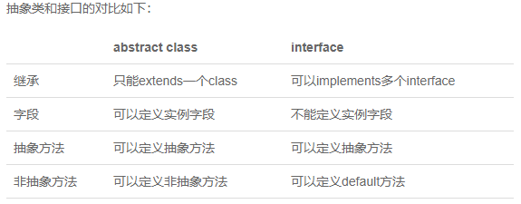
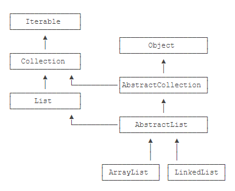
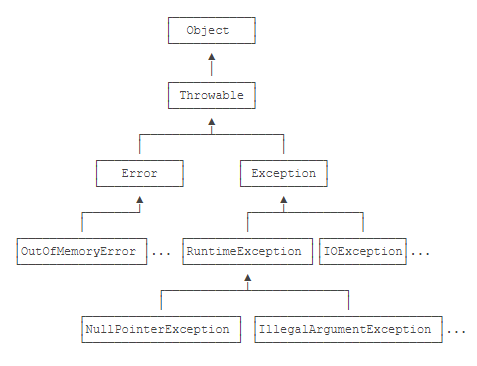
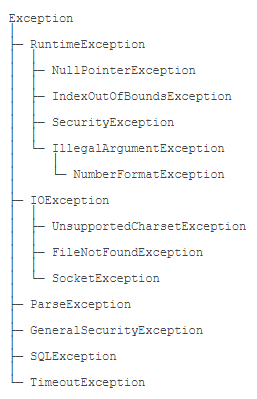

#### 名词解释

JAVA 介于编译型语言和解释型语言之间

代码--->字节码--->(*虚拟机*)--->机器码


- Java SE：Standard Edition
- Java EE：Enterprise Edition
- Java ME：Micro Edition


JDK: Java Development Kit

JRE：Java Runtime Environment

JSR规范: JAV Specification Request

JCP规范: JAVA Community Process

JSR是一系列的规范，从JVM的内存模型到Web程序接口，全部都标准化了。而负责审核JSR的组织就是JCP。

RI：Reference Implementation

TCK：Technology Compatibility Kit

有人提议要搞一个基于Java开发的消息服务器，这个提议很好啊，但是光有提议还不行，得贴出真正能跑的代码，这就是RI。如果有其他人也想开发这样一个消息服务器，如何保证这些消息服务器对开发者来说接口、功能都是相同的？所以还得提供TCK。

#### JAVA环境设置

https://www.runoob.com/java/java-environment-setup.html

`JAVA_HOME` `PATH` ` CLASSPATH`三个环境变量

在`JAVA_HOME`的`bin`目录下找到很多可执行文件：

- java：这个可执行程序其实就是JVM，运行Java程序，就是启动JVM，然后让JVM执行指定的编译后的代码；

- javac：这是Java的编译器，它用于把Java源码文件（以`.java`后缀结尾）编译为Java字节码文件（以`.class`后缀结尾）；

- jar：用于把一组`.class`文件打包成一个`.jar`文件，便于发布；

- javadoc：用于从Java源码中自动提取注释并生成文档；

- jdb：Java调试器，用于开发阶段的运行调试。
  

  

Java规定，某个类定义的`public static void main(String[] args)`是Java程序的固定入口方法，因此，Java程序总是从`main`方法开始执行。

Java入口程序规定的方法必须是静态方法，方法名必须为`main`，括号内的参数必须是String数组。

Java源码的缩进不是必须的。

当我们把代码保存为文件时，文件名必须是`Hello.java`，而且文件名也要注意大小写，因为要和我们定义的类名`Hello`完全保持一致。

Java 11后可以直接运行一个单文件源码，但在实际项目重，需要依赖第三方库，所以，绝大多数情况下，我们无法直接运行一个Java源码文件

JAVA的基本单位是`class`,在class内部，可以定义若干方法(method)

类名要求：

- 类名必须以英文字母开头，后接字母，数字和下划线的组合
- 习惯以大写字母开头

基本数据类型

- 整数类型：byte(-128-127)，short(-32768-32767)，int(-2147483648-2147483647)，long( -9223372036854775808 ~ 9223372036854775807)
- 浮点数类型：float，double
- 字符类型：char
- 布尔类型：boolean


note:int a=2_000_000表示2000000，可以被识别 

0x表示十六进制，ob表示二进制,long型结尾需要加L，float型结尾需要加f

f浮点数可以用科学计数法进行表示，例如

```java
float f1 = 3.14f;
float f2 = 3.14e38f; // 科学计数法表示的3.14x10^38
double d = 1.79e308;
double d2 = -1.79e308;
double d3 = 4.9e-324; // 科学计数法表示的4.9x10^-324
```

浮点数可表示的范围非常大，`float`类型可最大表示3.4x1038，而`double`类型可最大表示1.79x10308

Java的`char`类型除了可表示标准的ASCII外，还可以表示一个Unicode字符：单引号

引用类型

String 字符串

常量 关键字`final`，常量初始化后不可再赋值，常量名字通常大写

`var` 关键字 ，自动推断变量类型

（1）只能用于局部变量上；

（2）声明时必须初始化；

（3）不能用作方法参数。

 note: 定义变量时，要遵循作用域最小化原则，尽量将变量定义在尽可能小的作用域，并且，不要重复使用变量名。

整除`/`取余`%` 自增`++` 自增`--`

移位操作 `<<n`左移n位,，乘2的n次方；`>>n`右移n位除以2的n次方，注意数据长度限制

无符号右移`>>>`

溢出，数据超出范围限制

对`byte`和`short`类型进行移位时，会首先转换为`int`再进行位移

位运算

`&`按位与`|`按位或`~`按位非`^`按位异或


类型自动提升和强制转换

在运算过程中，如果参与运算的两个数类型不一致，那么计算结果为较大类型的整型。例如，`short`和`int`计算，结果总是`int`，原因是`short`首先自动被转型为`int`：

将大范围的整数转型为小范围的整数，强制转型使用`(类型)`，例如，将`int`强制转型为`short`但是有可能出错

浮点数不能做位运算和以为运算。浮点数是不精确的。

如何比较两个浮点数是否相等？判断两个浮点数之差的绝对值是否小于一个很小的数。

Java的浮点数完全遵循[IEEE-754](https://web.archive.org/web/20070505021348/http://babbage.cs.qc.edu/courses/cs341/IEEE-754references.html)标准

布尔运算

`>` `>=` `<` `<=` `==` `!=` `&&` `||` `!`


如果一个布尔运算的表达式能提前确定结果，则后续的计算不再执行，直接返回结果。

`? :运算符 `三元运算`b ? x : y`后面的类型必须相同


转义符`\u`将unicode编码表示一个字符。

```java
char c = ‘\u0041’\\'A'
```


多行字符串

```java
“”“...”""
```

字符串的不可变特性：Java的字符串除了是一个引用类型外，还有个重要特点，就是字符串不可变。

null表示不存在，，即变量不指向任何对象，“”表示空字符串

Java的数组：

- 数组所有元素初始化为默认值，整型都是`0`，浮点型是`0.0`，布尔型是`false`；
- 数组一旦创建后，大小就不可改变。

数组是**引用类型**，在使用索引访问数组元素时，如果索引超出范围，运行时将报错

```java
int[] ns=new int[5];
int[] ns=new int[]{1,2,3,4,5};
int[] ns = {1,2,3,4,5};
```

字符串数组

```java
String[] = {"ds","we","dw"}
```

输入和输出

```java
System.out.println()//输出并换行
System.out.print()//输出不换行
System.out.printf()//参数格式化
```

格式化输出

| 占位符 | 说明                             |
| ------ | -------------------------------- |
| %d     | 格式化输出整数                   |
| %x     | 格式化输出十六进制整数           |
| %f     | 格式化输出浮点数                 |
| %e     | 格式化输出科学计数法表示的浮点数 |
| %s     | 格式化字符串                     |

note:%%表示一个%字符，两个%占位符必须传入两个数

```java
int n = 12345000;
System.out.printf("n=%d, hex=%08x", n, n); // 注意，两个%占位符必须传入两个数
```

标准输入流`system.in`标准输出流`system.out`

scanner.nextline()和scanner.nextInt()分别读取用户读取的整数和int

条件语句

判断引用类型的变量内容是否相等，用`equals()`方法，注意避免`NullPointerException`。

if 语句

switch语句

yield关键字

循环语句

`for each`循环

遍历数组，除了常用的方法也可以用`Arrays.toString()方法。`

```java
int ns[] = {1,2,3,4,5}; 
System.out.println(Arrays.toString(ns))
```

二维数组中每个数组元素的长度不要求相同，打印二维数组可以用`Arrays.deepToString()`方法。

#### 面向对象

##### 重载

##### 继承

子类继承父类，自动获得父类的所有字段，子类不能定义与父类重名的字段。

任何类，除了`object`，都会继承自某个类。java只允许一个class继承一个类，一个类有且只有一个父类。`object`没有父类。

父类字段被`private`修饰的，不能被子类所访问。被`protected`修饰的，可以被子类以及子类的子类访问。

`super`表示父类(超类)，子类引用父类的字段时，可以用`super.fieldName`

子类不会继承任何父类的构造方法。如果父类没有默认的构造方法，子类必须显式调用`super`并给出参数以便让编译器定位到弗雷德一个合适的构造方法。

正常情况下，只要一个class没有`final`关键字，任何类都可以继承该class。

java15后，可以用`sealed`修饰class,，并通过`permits`明确写出能够从该类继承的子类名称。

```java
public sealed class Shape permits Rect, Circle, Triangle {
    ...
}
public final class Rect extends Shape {...}
public final class Ellipse extends Shape {...}
// Compile error: class is not allowed to extend sealed class: Shape
//sealed类在Java 15中目前是预览状态，要启用它，必须使用参数--enable-preview和--source 15
```

如果一个引用类型是超类，它也可以指向自己子类的实例。

```java
//向上转型
class Student extends Person{ ... }
Person p = new Student();

```

如果把一个父类类型强制转型为子类类型，即向下转型，有可能失败。

```java
Person p1 = new Student()；
Person p2 = new Person();
Student s1 = (Student) p1;
Student s2 = (Student) p2;//runtime error!ClassCastException
```

`instanceof`用来判断一个实例是不是某种类型。，如果一个引用类型位null，那么对任何`instanceof`的判断都为`false`。

继承的关系是IS，组合的关系是HAS

##### 多态

`@Override`关键字表示多态，override和overload不同的地方在于，如果方法签名不同，就是重载，如果相同，返回值也相同，就是多态。

如果在类方法或者类之前加`abstract`关键字，表示抽象方法和抽象类。包含抽象方法的类必须加`abstract`类。

@Override可以让编译器检查是否进行了正确的覆写。

**多态是指，针对某个类型的方法调用，其真正执行的方法取决于运行时期实际类型的方法。**

多态的特性就是，运行期才能动态决定调用的子类方法。对某个类型调用某个方法，执行的实际方法可能是某个子类的覆写方法。

object类定义了几个重要的方法

```java
toString():把instance输出为string
equals():判断两个实例是否逻辑相等
hashCode(）计算实例的哈希值
```

必要时可以覆写这几个方法

被final修饰的父类方法不可以被子类继承，被final修饰的类不能被继承，被final修饰的字段在初始化后不能被重新赋值

面向抽象编程的本质就是：

- 上层代码只定义规范（例如：`abstract class Person`）；
- 不需要子类就可以实现业务逻辑（正常编译）；
- 具体的业务逻辑由不同的子类实现，调用者并不关心。

##### 接口

如果一个抽象类没有字段，所有方法全部都是抽象方法，就可以把该抽象类改写为接口：`interface`。

`interface`，就是比抽象类还要抽象的纯抽象接口，因为它连字段都不能有。

当一个具体的`class`去实现一个`interface`时，需要使用`implements`关键字。

一个类可以实现多个`interface`





```java
List list = new ArrayList(); // 用List接口引用具体子类的实例
Collection coll = list; // 向上转型为Collection接口
Iterable it = coll; // 向上转型为Iterable接口
```

一般来说，公共逻辑适合放在`abstract class`中，具体逻辑放到各个子类，而接口层次代表抽象程度。

在接口中,`default`修饰的方法无法访问字段,实现类可以不必覆写`default`修饰的方法

`default`方法的目的是，当我们需要给接口新增一个方法时，会涉及到修改全部子类。如果新增的是`default`方法，那么子类就不必全部修改，只需要在需要覆写的地方去覆写新增方法。

`static`字段不属于任何一个实例.

*不推荐用`实例变量.静态字段`去访问静态字段，因为在Java程序中，实例对象并没有静态字段。在代码中，实例对象能访问静态字段只是因为编译器可以根据实例类型自动转换为`类名.静态字段`来访问静态对象。推荐用类名来访问静态字段。可以把静态字段理解为描述`class`本身的字段（非实例字段）*。

通常情况下，通过实例变量访问静态字段和静态方法，会得到一个编译警告.

`interface`的静态字段必须为`final`类型：

`package`没有父子关系,包名不同,即使类名相同也是不同的类。

==<u>编译语言注意</u>==

```java
javac -d ../bin ming/Person.java hong/Person.java mr/jun/Arrays.java
```

https://www.liaoxuefeng.com/wiki/1252599548343744/1260467032946976

嵌套类：定义在一个class内部的class成为嵌套类(nested class),nested类的实例不能单独存在，必须依附于一个外部类的实例。

匿名类

```java
public class Main {
    public static void main(String[] args) {
        Outer outer = new Outer("Nested");
        outer.asyncHello();
    }
}

class Outer {
    private String name;

    Outer(String name) {
        this.name = name;
    }

    void asyncHello() {
        Runnable r = new Runnable() {
            @Override
            public void run() {
                System.out.println("Hello, " + Outer.this.name);
            }
        };
        new Thread(r).start();
    }
}

```

匿名类和Inner Class一样，可以访问Outer Class的`private`字段和方法。之所以我们要定义匿名类，是因为在这里我们通常不关心类名，比直接定义Inner Class可以少写很多代码。

除了接口外，匿名类也完全可以继承自普通类。

使用局部变量时，应该尽可能把局部变量的作用域缩小，尽可能延后声明局部变量。

用`final`修饰`class`可以阻止被继承,用`final`修饰`method`可以阻止被子类覆写,用`final`修饰`field`可以阻止被重新赋值,用`final`修饰局部变量可以阻止被重新赋值.

一个`.java`文件只能包含一个`public`类，但可以包含多个非`public`类。如果有`public`类，文件名必须和`public`类的名字相同。

用`static`修饰的内部类和Inner Class有很大的不同，它不再依附于`Outer`的实例，而是一个完全独立的类，因此无法引用`Outer.this`，但它可以访问`Outer`的`private`静态字段和静态方法。如果把`StaticNested`移到`Outer`之外，就失去了访问`private`的权限。

#### JAVA核心类

##### String

String是一个引用类型，本身也是一个class,可以直接用“...”表示一个字符串。

在内部通过char[]数组实现
```java
String s2 = new String(new char[] {'H','e','l','l','o'});
string s1 = "Hello";
```

```java
equals() //比较两个String是否相等用,而不是==,
equalsIgnoreCae()//比较string忽略大小写
contains()//来判断是否包含子串，方法参数是String的父类CharSequence
indexOf() //判断字串的第一次出现位置
LastIndexOf()//判断字串的最后一次出现位置
startsWith()//判断是否是以字串开头
endsWith()//判断是否是以字串结尾
substring()//一个参数是到结尾，两个参数是之间的字串
trim()//返回一个新的字符串，移除字符串首尾空白字符，包括空格,\t,\r,\n
strip()//移除字符串首尾空白字符包括空格字符\u3000
stripLeading()//只删除字符串开头的空格
stripTrailing()//只删除字符串的结尾的空格
replace()//用新字符替换所有目标字符
replaceAll()//将所有匹配的字符替换为新字符,正则表达式作为输入，以标识需要替换的目标子字符
replaceFirst()//用新字符串替换目标字符串第一次出现的字符
isEmpty()//判断空字符串
isBlank()//判断空字符
spilt()//分割字符串，传入正则表达式
join()//静态方法，拼接字符串，用指定的字符串连接字符串数组
foamatted()//传入其他参数，替换占位符，生成新字符串,在idea中报错，信息为某个API的一个预览功能 
format()//静态方法，替换占位符，生成新字符串 
ValueOf()//静态方法，把任意基本类型或引用类型转换为字符串 
Integer.parseInt()//静态方法把字符串转换为int类型 
Boolean.parseBoolean()//静态方法，字符串->bool 
Integer.getInteger()//静态方法，把字符串对应的系统变量转换为
Integer toCharArray()//string->char[] String(char[])的构造函数可以把char[]作为参数，通过把char[]复制一遍再传入实例内部，构造函数可能用了clone()方法 getByte()//传递编码，将字符串转换为其他编码格式，得到byte[]数组 
String(byte[]，"encode")//将已知编码的byte[]转换成string
```

转义符

| `\t`     | 水平制表符相当于TAB键                  |
| -------- | -------------------------------------- |
| `\n`     | 回车换行，将当前位置移动到下一行的开头 |
| `\r`     | 回车，将当前位置移动到本行的开头       |
| `\u3000` | 拳脚空格，中文文章中使用               |

占位符

| %s   | 显示字符串       |
| ---- | ---------------- |
| %d   | 显示整数         |
| %x   | 显示十六进制整数 |
| %f   | 显示浮点数       |

###### 字符编码

- ACSII 码范围，0-127，最高位为0

- GB2312码，两个字节表示一个汉字，第一个字节的最高位为1

- Unicode编码 

- utf-8:Unicode的一种改进一种变长编码，用来把固定长度的Unicode编码变成1～4字节的变长编码。

**Java的`String`和`char`在内存中总是以Unicode编码表示**。

早期JDK版本的`String`用`char[]`存储，新版本存储`byte[]`，节省内存。如果String仅包含ASCII字符，则每个`byte`存储一个字符，否则，每两个`byte`存储一个字符。大量的长度较短的`String`通常仅包含ASCII字符

##### StringBuilder

在循环里通过`+`拼接`String`,会产生大量的临时对象，然后扔掉旧的字符串，浪费内存，降低GC效率。StringBuilder可以预分配缓冲区，不创建新的临时对象，通过append()方法直接拼接String，且支持链式操作

若想让类方法支持链式操作，在类方法里面返回this指针

对于普通的字符串+操作，并不需要我们将其改写为StringBuilder，因为Java编译器在编译时就自动把多个连续的+操作编码为StringConcatFactory的操作。在运行期，StringConcatFactory会自动把字符串连接操作优化为数组复制或者StringBuilder操作。

`StringBuffer`，这是Java早期的一个`StringBuilder`的线程安全版本，它通过同步来保证多个线程操作`StringBuffer`也是安全的，但是同步会带来执行速度的下降。`StringBuilder`和`StringBuffer`接口完全相同，现在完全没有必要使用`StringBuffer`。

##### StringJoiner

用分隔符拼接数组可以指定分隔符以及开头和结尾

```java
String.join()//在不指定开头和结尾时会更方便
```

##### 包装类型

java 基本类型：`byte、short、 int、 long、 boolean、 float、 double、 char`

引用类型：`class、interface`

**为什么java要有包装类型**

引用类型可以赋值为null，基本类型不能赋值为null

每种基本类型都对应了一种包装类型

| boolean | java.lang.Boolean  |
| ------- | ------------------ |
| byte    | java.lang.Byte     |
| int     | java.lang.Interger |
| short   | java.lang.Short    |
| char    | java.lang.Char     |
| double  | java.lang.Double   |
| float   | java.lang.Float    |
| long    | java.lang.Long     |

**Auto Boxing** 和**Auto UnBoxing**，自动装箱和自动拆箱只发生在**编译阶段**，目的是为了少写代码。

引用类型不能用`==`比较，用`equals()`方法

Integer是不变类，编译器把Integer x = 127;自动变为Integer x = Integer.valueOf(127);，为了节省内存，Integer.valueOf()对于较小的数(-128-127)，始终返回相同的实例

创建Integer时，用

```java
Integer n = Integer.valueOf(100)//首选。将内部优化交给Integer的实现 
Integer n = new Integer(199)//总是创建新的实例
```

Integer.valueOf()就是静态工厂方法，它尽可能地返回缓存的实例以节省内存。创建新对象时，优先选用静态工厂方法而不是new操作符。

标准库返回的Byte实例全部是缓存实例，但调用者并不关心静态工厂方法以何种方式创建新实例还是直接返回缓存的实例。

```java
Integer.parseInt()//静态方法，将字符串解析为整数，可以指定进制 
Integer.toString()//静态方法，转化为字符串，可以指定进制 
Integer.toHexString()//静态方法，转化为字符串，表示为16进制
Integer.toOctalString()//静态方法，转化为字符串，表示为8进制
Integer.toBinaryString()//静态方法，转化为字符串，表示为2进制
```

我们经常使用的System.out.println(n);是依靠核心库自动把整数格式化为10进制输出并显示在屏幕上。

JAVA的和核心库还定义了一些静态变量

```java
// boolean只有两个值true/false，其包装类型只需要引用Boolean提供的静态字段: 
Boolean t = Boolean.TRUE; 
Boolean f = Boolean.FALSE; 
// int可表示的最大/最小值: 
int max = Integer.MAX_VALUE; // 2147483647
int min = Integer.MIN_VALUE; // -2147483648
// long类型占用的bit和byte数量:
int sizeOfLong = Long.SIZE; // 64 (bits) 
int bytesOfLong = Long.BYTES; // 8 (bytes)
```

在java中无符号整形与有符号整形的转换就需要借助包装类型的静态方法完成。

##### JavaBean

一种符合命名规范的class

特点：

- 有若干private字段
- 通过public方法读写实例字段

JavaBean类只有**getter**和**setter**方法(对应boolean字段是is和set),也称之为**属性**

用途：传递数据

使用java核心库提供的Introspector可以枚举一个JavaBean的所有属性。

```java
BeanInfo info = Introspector.getBeanInfo(Person.class);
for (PropertyDescriptor pd : info.getPropertyDescriptors()) {    
	System.out.println(pd.getName());    
	System.out.println("  " + pd.getReadMethod());    
	System.out.println("  " + pd.getWriteMethod()); 
} 
/*
*age 
* public int Person.getAge() 
* public void Person.setAge(int) 
*class 
* public final native java.lang.Class java.lang.Object.getClass() 
* null 
*name 
* public java.lang.String Person.getName() 
* public void Person.setName(java.lang.String) 
*/
```


##### 枚举类

enum关键字

不同类型的枚举不能互相比较或者赋值，可以用==比较，枚举类不能被继承，不能通过new创建，每个实例时引用类型的唯一实例

```java
name()//返回常量名
original()//返回定义常量的顺序
```

为了使得外部不能修改enum的顺序，可以将构造函数定义为private,在新增枚举常量是，也需要制定额外的信息

```java
public class Main {    
    public static void main(String[] args) {        
        Weekday day = Weekday.SUN;        
        if (day.dayValue == 6 || day.dayValue == 0) {            
            System.out.println("Today is " + day + ". Work at home!"); 
        } else {            
            System.out.println("Today is " + day + ". Work at office!");
        }    
    } 
} 
enum Weekday {    
    MON(1, "星期一"), TUE(2, "星期二"), WED(3, "星期三"), THU(4, "星期四"), FRI(5, "星期五"), SAT(6, "星期六"), SUN(0, "星期日");
    public final int dayValue;    
    private final String chinese;     
    private Weekday(int dayValue, String chinese) {        
        this.dayValue = dayValue;        
        this.chinese = chinese;    
    } 
    //覆写toString 方法，打印的时候更好的输出信息    
    @Override    
    public String toString() {        
        return this.chinese;    
    } 
}
```

枚举类很适合用在switch中

##### 记录类 

不变类的特点

定义class的时候用final，无法派生子类

每个字段使用final,保证创建实例后无法修改任何字段

```java
public record Point(int x, int y) {}//定义了一个Point不变类
```

在构造方法如果需要检查参数，需要在类的构造方法加上检查逻辑

```java
//Point类的x,y不允许负数 
//Compact Constructor 
public record Point(int x, int y) {    
	public Point {        
		if (x < 0 || y < 0) {            
    		throw new IllegalArgumentException();        
		}    
	} 
}
```

Point也可以加入静态方法，常用的是of()方法，用来创建record类Point

```java
public record Point(int x, int y) {    
    public static Point of() {        
        return new Point(0, 0);    
    }    
    public static Point of(int x, int y) {       
        return new Point(x, y);    
    } 
} //调用 var z = Point.of(); var p = Point.of(123, 456);
```

##### BigInteger类

表示任意大小的整数

CPU原生提供的整型最大范围是64位long型整数，使用long型整数可以直接通过cpu指令计算

BigInteger内部用int[]模拟一个非常大的整数

BingInteger的运算只能用实例方法，运算速度较慢

BigInteger继承自Number类，可以转换为基本类型，如果超过基本类型范围，高位信息将丢失，如果要准确转换，在超出范围时，会直接抛出ArithemeticException异常

##### BigDecimal

表示任意大小且精度完全准确的浮点数

```java
scale()//表示小数点位数，返回负数-n，表示这个数为整数，且末尾有n个0 
stripTrailingZeros()//可以将一个BigDecimal格式转化成为一个相等的，但是去掉末尾0的BigDecimal
```

对BigDecimal做除法的时候，需要指定精度以及如何截断。

```java
divideAndReminder()//同时计算商和余数 compareTo()/比较两个BigDecimal大小是否相同，正数、负数、0分别表示大于、小于、0
```

BigDecimal用一个BigInteger和int分别表示整数和小数位数。

##### Math类和StrichMath类

Java标准库还提供了一个StrictMath，它提供了和Math几乎一模一样的方法。这两个类的区别在于，由于浮点数计算存在误差，不同的平台（例如x86和ARM）计算的结果可能不一致（指误差不同），因此，StrictMath保证所有平台计算结果都是完全相同的，而Math会尽量针对平台优化计算速度，所以，绝大多数情况下，使用Math就足够了。

##### Random类

```java
Random r = new Random();//指定seed，得到一个完全确定的随机数序列，不指定seed，以当前时间戳作为种子 
r.nextInt(); // 2071575453,每次都不一样 
r.nextInt(10); // 5,生成一个[0,10)之间的
int r.nextLong(); // 8811649292570369305,每次都不一样 
r.nextFloat(); // 0.54335...生成一个[0,1)之间的float 
r.nextDouble(); // 0.3716...生成一个[0,1)之间的double
```

真正的真随机数只能通过量子力学原理来获取

###### SecureRandom类

无法指定种子，使用random number generator(RNG)算法，有多种不同的底层实现

```java
//先使用高等级安全随机数，再使用低等级安全随机数 
SecureRandom sr = null; try {    
    sr = SecureRandom.getInstanceStrong(); 
} catch (NoSuchAlgorithmException e) {    
    sr = new SecureRandom(); 
} 
//将生成随机数放到byte[]数组
byte[] buffer = new byte[16]; 
sr.nextBytes(buffer); 
System.out.println(Arrays.toString(buffer));
```


#### 异常处理

调用方法获知调用失败的信息方法;1 预定返回错误码2异常处理机制

在java中，异常也是一种类，继承关系





Error表示严重的错误，包括: 

- OutmemoryError(内存耗尽)
- NoClassDefFoundError(无法加载某个class)
- StackOverflowError(栈溢出)

Exeception运行时的错误，可以被捕获处理，包括

- NumberFormatExeception(数值类型格式错误)
- FileNotFoundException(未找到文件)
- SocketException(读取网络失败)
- nullPointerException(对nul对象调用方法或字段)
- IndexOutOfBoundsException(数组越界)

Exception分两类，RuntimeException和非RuntimeException(包括IoException、ReflectiveOperationException)

必须捕获的异常包括Exception及其子类，不包括RuntimeException及其子类->Checked Exception，不需要捕获的异常包括Error及其子类，RuntimeException

异常的捕获用try catch

在方法定义的时候，使用throws Xxx表示该方法可能抛出的异常类型。调用方在调用的时候，必须强制捕获这些异常，否则编译器会报错。

也可在main方法后声明`throws Exception`，代价是出现任何异常，程序会立刻退出

不要再try catch里面啥也不干，可以先用printStackTrace打印异常

try catch可使用多个catch语句，但只匹配一个catch,存在多个catch的情况时，将子类写在前面。try catch语句后可以加finally语句，最后执行，可写可不写。

可以用|将多个异常放在同一个catch语句里

当某个方法抛出了异常时，如果当前方法没有捕获异常，异常就会被抛到上层调用方法，直到遇到某个try ... catch被捕获为止：

如果一个方法捕获了某个异常后，又在catch子句中抛出新的异常，就相当于把抛出的异常类型“转换”了：

```java
void process1(String s) {    
	try {        
		process2();    
	} catch (NullPointerException e) {        
		throw new IllegalArgumentException();    
    } 
} 
void process2(String s) {   
    if (s==null) {        
        throw new NullPointerException();    
    } 
}
//当process2()抛出NullPointerException后，被process1()捕获，然后抛出IllegalArgumentException()
```

catch中抛出异常，不会影响finally的执行。JVM会先执行finally，然后抛出异常。

异常屏蔽;zai执行finally语句抛出异常，catch语句准备抛出的异常找不到了。

通过origin变量保存原始一场，然后调用Throwable.addSuppressed()添加原始一场，最后在finally抛出

```java
public class Main {    
    public static void main(String[] args) throws Exception {        
        Exception origin = null;        
        try {            
            System.out.println(Integer.parseInt("abc"));        
        } 
        catch (Exception e) {            
            origin = e;            
            throw e;        
        } finally {            
            Exception e = new IllegalArgumentException();            
            if (origin != null) {                
                e.addSuppressed(origin);            
            }            
            throw e;        
        }    
    } 
}
```

绝大多数情况下，在finally中不要抛出异常。

e.printStackTrace()//打印异常栈，但不中断后续程序 throw e//中断程序并抛出异常

Java自定义异常栈包括：


也可以自定义异常栈，自定义一个BaseException作为“根异常”，然后，派生出各种业务类型的异常。BaseException通常建议从RuntimeException派生：

其他业务类型的异常就可以从BaseException派生，自定义的BaseException应该提供多个构造方法。

NullPointerException空指针异常，NPE，如果一个对象为null，调用其方法或访问其字段就会产生NullPointerException，这个异常通常是由JVM抛出的

NullPointerException是一种代码逻辑错误，遇到NullPointerException，遵循原则是早暴露，早修复，严禁使用catch来隐藏这种编码错误

避免NPE:

```java
//成员变量定义初始化 
public class Person {    
	private String name = ""; 
} 
//返回空字符串 
public String[] readLinesFromFile(String file) {    
    if(getFileSize(file) == 0) {        
        return new String[0];    
    } 
} 
//如果调用方一定要根据null判断，比如返回null表示文件不存在，那么考虑返回Optional<T>： 
public Optional<String> readLineFromFile(String file) {   
    if(!fileExist(file)) {       
        return Optional.empty();        
        ...    
    } 
}
```

定位NPE

```shell
java -XX:+ShowCodeDetailsInExceptionMessages Main.java//jdk14后
```

或者在可能的地方打印日志，pintln()

###### 断言assert

```java
public static void main(String[] args) {    
    double x = Math.abs(-123.45);    
    assert x >= 0 : "x must >= 0";    
    System.out.println(x); 
}
```

断言应用在开发和调试阶段，断言失败，抛出AssertionError

要执行assert语句，必须给Java虚拟机传递-enableassertions（可简写为-ea）参数启用断言。断言很少被使用，更好的方法是编写单元测试

idea 设置jvm参数run->editConfigurations->vm options


